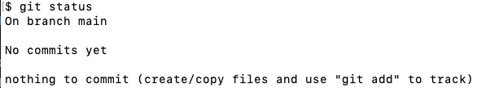
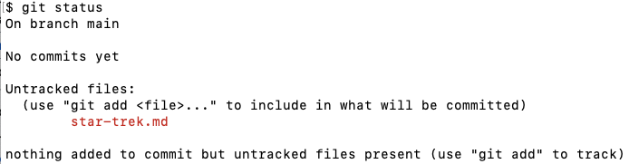
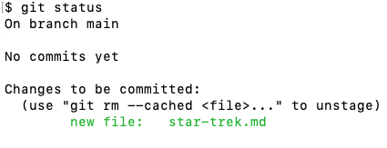
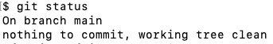
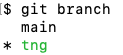
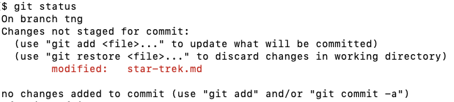
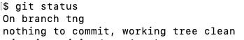

# An Introduction to Git

## Installation

This talk is going to assume that you have [Git](https://git-scm.com/doc) and [Visual Studio Code](https://visualstudio.microsoft.com/) installed.

If you need Git installed please follow instructions here:

- [MacOs](https://git-scm.com/download/mac)
- [Windows](https://git-scm.com/download/win)
- [Linux](https://git-scm.com/download/linux)

If you need [Visual Studio Code](https://visualstudio.microsoft.com/) installed please follow instructions here:

- [Downloads](https://visualstudio.microsoft.com/downloads/)

## Overview

Okie dokie artichokies, let's come together and talk about [Git](https://git-scm.com/doc). This talk will cover the following:

- Version Control; what is it? Why do we need it?
- Standard Git Workflow
- Branching

## Version Control; what is it? Why do we need it?

Version control is a system that allows you to keep track of changes to a source of truth over time. This is how teams large and small move forward with their projects. So why do we need a system can't we just use multiple saves? We could, sure, but it would be inefficient to have to wait for your team member to finish something before you can start your work.

Git is just one of many version control systems out there. It is a distributed version control system. This means that each developer has a copy of the entire repository on their local machine. This allows for offline work and the ability to work on multiple branches at once.

## Standard Git Workflow

So how do I use the version control system called Git? We will start by creating a new Git repository on our local machine and later we will push it up to [GitHub](https://github.com)

### Creating a new repository

A Git repository is just a directory with a `.git` directory inside of it. To create a new repository we just need to create a new directory and run the command `git init`. This will create a `.git` directory inside of the directory you are in. This is the directory that Git will use to keep track of all the changes you make to your files and directories.

#### 💻 Code-Along: Create a new Git repository

```bash
mkdir git-demo
cd git-demo
git init
```

- `mkdir git-demo` - This will create a new directory called `git-demo`.
- `cd git-` - This will change your current directory to the `git-demo` directory.
- `git init` - This will create a new `.git` directory inside of the `git-demo` directory.

> Note: We can check if this worked by running the command `ls -a`. This will list all the files and directories in the current directory. The `-a` flag will show all files and directories including hidden ones. You should see a `.git` directory in the list.

### Git workflow: Modified, Staged, Committed

Once we have a repository we can start to use Git to keep track of our changes. Git has three states that a file can be in: modified, staged, and committed. Let's take a look at each of these states.

#### Modified

The modified state is when a file has been changed but not staged. This means that Git is aware that there are some changes in the file but it is not tracking them. To see what files have been modified we can run the command `git status`. This will show us all the files that have been modified.

#### 💻 Code-Along: Create a new file and modify it

Inside our `git-demo` directory if we run the command `git status` we should see something like this:



Let's add a file named `star-trek.md` and add some text to it.

```bash
touch star-trek.md
code .
```

- `touch star-trek.md` - This will create a new file called `star-trek.md`.
- `.md` - This is a [Markdown](https://www.markdownguide.org/getting-started/) file.
- `code .` - This will open the current directory in [Visual Studio Code](https://code.visualstudio.com/).
- `.` - Represents the current directory.

Add the following text to the `star-trek.md` file:

```md
Captain - James T. Kirk
Chief Medical Officer - Leonard "Bones" McCoy
Chief Engineer - Montgomery "Scotty" Scott
```

Now if we run the command `git status` we should see something like this:



👀 -> Notice that the `star-trek.md` file is listed under the `Untracked files` section. Git is aware that this file exists but it is not tracking it. We can tell Git to start tracking this file by adding it to the staging area.

> Note: Current working directory should be `git-demo`

#### Staged

The staged state is when a file has been changed and Git is tracking those changes. To stage a file we use the command `git add`. This will add the file to the staging area. Once a file is in the staging area we can commit it.

#### 💻 Code-Along: Stage a file

To stage the `star-trek.md` file we can run the command:

```bash
`git add star-trek.md`
```

- `git add` - This will add the file to the staging area.
- `star-trek.md` - This is the file we want to add to the staging area.

Now if we run the command `git status` we should see something like this:



👀 -> Notice that the `star-trek.md` file is listed under the `Changes to be committed` section. Git is now tracking this file and is ready to commit it.

> Note: Current working directory should be `git-demo`

#### Committed

To commit a file we use the command `git commit`. This will create a new commit with the files in the staging area. A commit is a snapshot of the current state of the repository. It is a way to group changes together.

#### 💻 Code-Along: Commit a file

To commit the `star-trek.md` file we can run the command:

```bash
git commit -m "Added star-trek.md"
```

- `git commit` - This will create a new commit with the files in the staging area.
- `-m` - This option will allow us to add a message. This is required.
- `"Added star-trek.md"` - This is the message for the commit.

Now if we run the command `git status` we should see something like this:



We have now come full circle and Git is waiting for us to modify a file or directory.

## Git Branches

Git has a feature called branches. A brach is a way to separate our work from the original codebase. When we make a new local Git repository it will have a branch called `main`. This is the default branch.

But why do we want to use branches and why is branching important? Branches allow us to work on a feature or bug fix without affecting the original codebase. This is important because companies cannot have their sites go down every time they need to update or fix something. By branching and merging we can make sure that the codebase is always working.

### Creating a new branch

Since we have a new repository we already have a branch called `main`. We can see all the branches in our repository by running the command `git branch`. This will list all the branches in our repository. The branch with the `*` next to it is the branch we are currently on.

#### 💻 Code-Along: Create a new branch

Let's create a new branch called `tng` and switch to it.

```bash
git branch tng
git checkout tng
```

- `git branch tng` - This will create a new branch called `tng`.
- `git checkout tng` - This will switch to the `tng` branch.

Now if we run the command `git branch` we should see something like this:



👀 -> Notice that the `*` is next to the `tng` branch. This means that we are currently on the `tng` branch.

Now let's modify the `star-trek.md` file:

```md
Captain - Jean-Luc Picard
Chief Medical Officer - Beverly Crusher
Chief Engineer - Geordi La Forge
```

Run the command `git status` and we should see something like this:



Stage and commit these changes:

```bash
git add star-trek.md
git commit -m "Updated star-trek.md"
```

Now if we run the command `git status` we should see something like this:



We have now committed our changes to the `tng` branch. Let's switch back to the `main` branch and see what happens.

```bash
git checkout main
code .
```

- `git checkout main` - This will switch to the `main` branch.
- `code .` - This will open the current directory in [Visual Studio Code](https://code.visualstudio.com/).

We can see that our `star-trek.md` file has the original Star Trek characters. Let's switch back to the `tng` branch and see what happens.

```bash
git checkout tng
code .
```

👀 -> It's the characters from Star Trek: The Next Generation. We can switch back and forth between branches and see the changes but this is how we separate our work from the original codebase.
